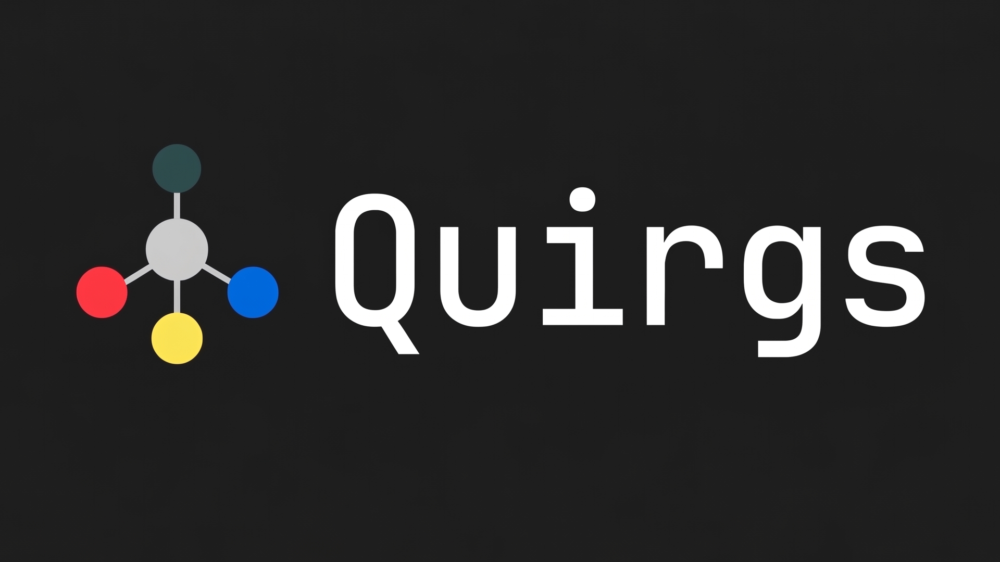

# Quirgs V2

> **[SYSTEM]** Legacy infrastructure successfully archived. Constructing AI-native command center...

## The Pivot

Quirgs is undergoing a fundamental transformation. We are sunsetting our static, human-written reference guides and completely re-imagining our concept from the ground up. 

In the age of thinking models and agentic coding, the needs of the open-source community have evolved. Quirgs V2 represents a hard pivot from **human reference material** to **AI-native context, workflows, and actionable tooling**.

## Why the Change?

Every developer knows the frustration of digging through lengthy documentation. But as AI models become our pair programmers, the problem space has shifted. It's no longer just about making information *scannable for humans*, but about creating environments that are *legible and actionable for AI assistants*.

Quirgs V2 focuses on building scaffolding designed specifically for AI workflows:

- **AI Contexts** - Providing models with the precise, high-signal information they need.
- **Agentic Workflows** - Actionable chains of execution tailored for thinking models.
- **Developer Tooling** - Bridging the gap between human intent and autonomous execution.

## What's Next?

Our concept is currently in stealth development, but ideas are actively being brainstormed. Expect to see:

- Advanced generative scaffolding.
- New SOPs modeled specifically for AI code agents.
- Tools built for the open-source AI community.

More to come.
